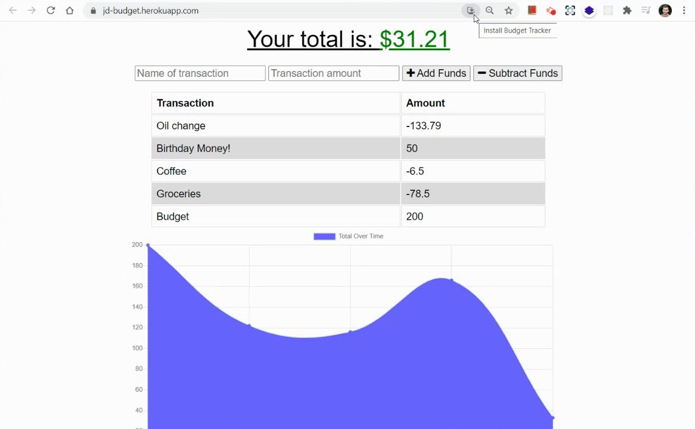

<!-- Add .svg Images -->

# Budget PWA
<div>
  
  


</div>

### PWA for accessing and updating budget information on or offline
<br>

## Table of Contents  
* [Features](#Features)  
* [Installation](#Installation)  
* [Usage](#Usage)  
* [Technologies](#Technologies-Used)
* [Contributing](#Contributing)  
* [Future Scope](#Future-Scope)  
* [Questions](#Questions)

## Features
- Current total is displayed in green on top of page and changes to red if budget is exceeded (total is negative)
- Add/subtract funds with click of a button
- Transaction history is displayed in a table as well as a graph
- Able to add transactions offline - any offline transactions are stored in browser's indexedDB & automatically posted to database once reconnected

## Installation
0. Download project by clicking 

at the top of this repository, and open project directory in terminal.
1. Install npm packages: `express mongoose morgan compression`
    ```
    npm i
    ```

## Usage
Currently deployed with [Heroku](https://jd-budget.herokuapp.com/)

0. Begin by setting a total budget amount and hitting `Add Funds`
1. Enter a name and dollar amount for a new transaction.
2. Add or subtract amount using corresponding buttons.
3. Transaction will be automatically populated in table and graph below.
    

## Technologies Used
- [Express](https://expressjs.com/)
- [MongoDB](https://www.mongodb.com/)/[Mongoose](https://mongoosejs.com/docs/)
- [Morgan](https://www.npmjs.com/package/morgan/)
- [Compression](https://www.npmjs.com/package/compression/)
- Service Worker
- IndexedDB

## Contributing
Contributions welcome!
1. Fork this repository  
2. Create a new branch  
3. Commit/push your changes  
4. Create a new pull request  

## Future Scope
- Incorporate login system
- Webpack config

## Questions  
If you have any questions, feel free to create an [Issue](https://github.com/JoelDore/progressive-budget/issues) or contact me directly at dore.joel.dore@gmail.com

## License
This project is [MIT](https://github.com/JoelDore/progressive-budget/blob/main/LICENSE) licensed.  
© 2021 [Joel Dore](https://github.com/JoelDore)  

---
<br>

<div align="center">

[](mailto:dore.joel.dore@gmail.com) 
[](https://github.com/JoelDore) 
[](https://www.linkedin.com/in/joeldore) 
<a href="https://www.buymeacoffee.com/JoelDore" target="_blank"></a>

</div>